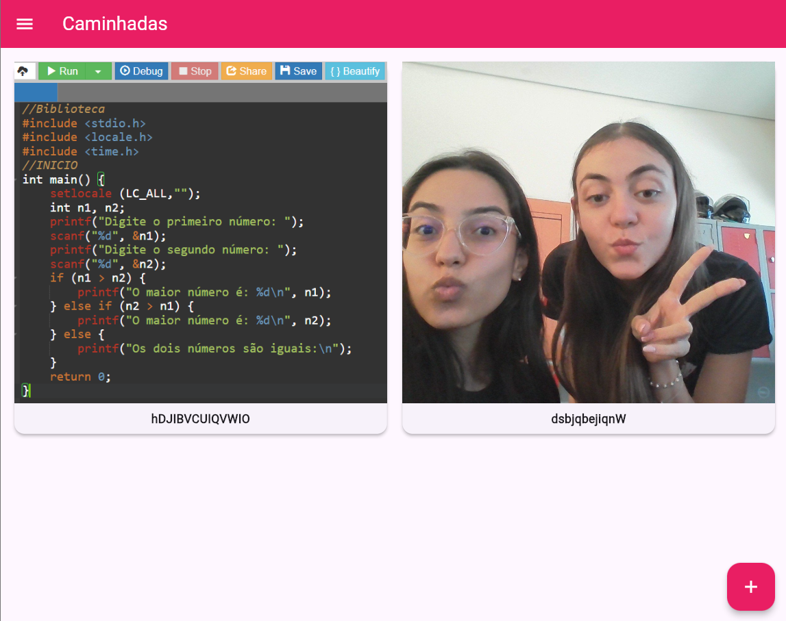
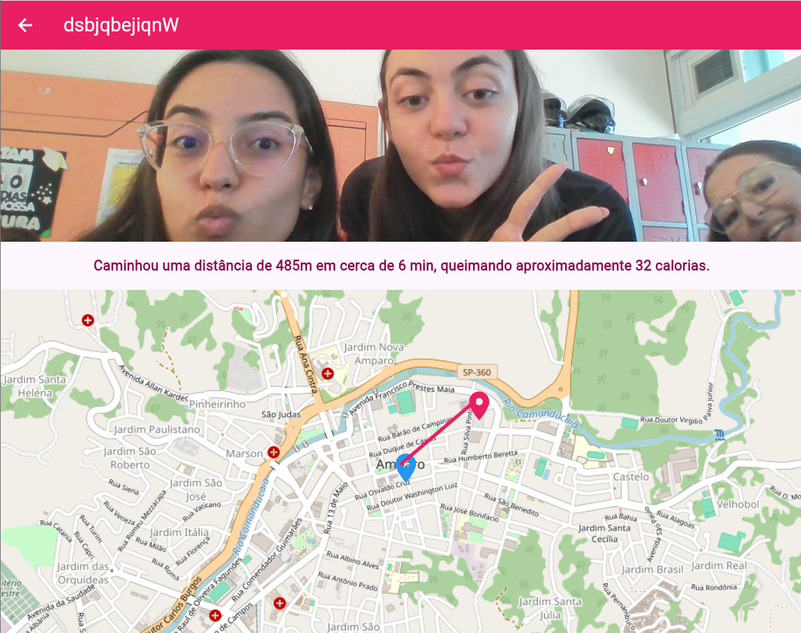
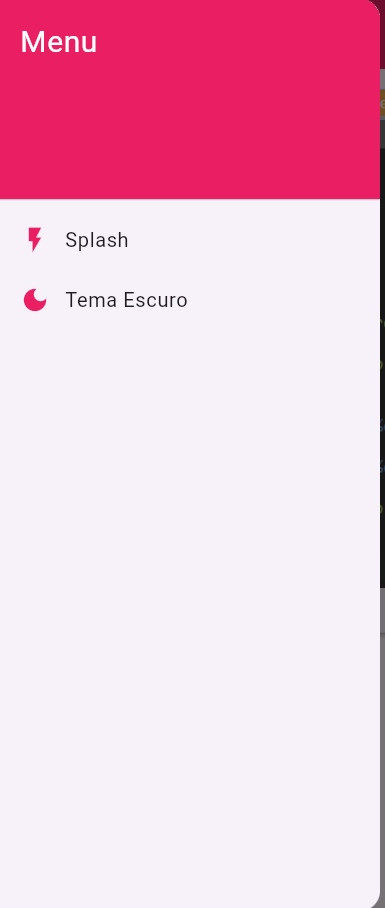

# App Caminhadas

Uma aplicação em Flutter desenvolvida para registar e acompanhar caminhadas, permitindo aos utilizadores visualizar rotas num mapa, acompanhar métricas de distância e calorias, e associar fotos a cada registo.

---

## Funcionalidades

-  **Mapeamento de Rotas:** Integração com mapas interativos para exibições de rotas com marcadores de início e fim.
- **Registo Fotográfico:** Adição e seleção de imagens da galeria para personalizar cada caminhada (compatível com Flutter Web e dispositivos móveis).
- **Métricas de Exercício:** Cálculo automático e estimativa de distância percorrida, tempo de duração e calorias queimadas.
- **Suporte a Temas:** Alternância simples entre Tema Claro (*Light Mode*) e Tema Escuro (*Dark Mode*).
- **Interface Fluida:** Navegação simples com navegação por grelha (*GridView*), *Drawer* de navegação e ecrãs de detalhes.

---

## Prints







---

## Como Executar o Projeto

1. **Clonar o repositório:**
   ```bash
   git clone https://github.com/dudamssr/app_caminhadas.git
